 
## 查看主页获取源码

> **作者介绍**： **✌**全网粉丝10W+本平台特邀作者、博客专家、CSDN新星计划导师、java领域优质创作者,博客之星、掘金/华为云/阿里云/InfoQ等平台优质作者、专注于项目实战 **✌**

  

### 一、作品包含

源码+数据库+设计文档万字+PPT+全套环境和工具资源+部署教程

### 二、项目技术

前端技术：Html、Css、Js、Vue、Element-ui

数据库：MySQL

后端技术：Java、Spring Boot、MyBatis

  

### 三、运行环境

开发工具：IDEA/eclipse + 微信开发者工具

数据库：MySQL5.7

数据库管理工具：Navicat10以上版本

环境配置软件： JDK1.8+Maven3.6.3

前端Nodejs：14

### 四、项目介绍
项目编号：mpweixinA025

高校二手商品交易微信小程序是一款专为大学生群体设计的便捷交易平台，旨在解决校园内二手物品的买卖需求。通过这款小程序，学生可以轻松发布闲置教材、生活用品、电子产品等二手商品信息，同时也能快速找到自己需要的物品。小程序利用微信的社交属性，简化了交易流程，提高了交易效率，不仅促进了校园资源的循环利用，还培养了学生的环保意识，为校园生活增添了一份便捷与绿色。

前台用户功能：首页、二手物品、校园论坛、公告信息、二手物品、二手交易、我要发帖、我的发帖。

后台管理员的功能：系统首页、个人中心、用户管理、物品分类管理、二手物品管理、二手交易管理、校园论坛、系统管理。

### 五、运行截图

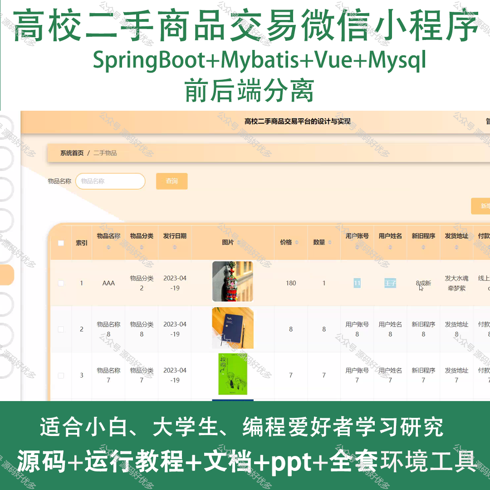
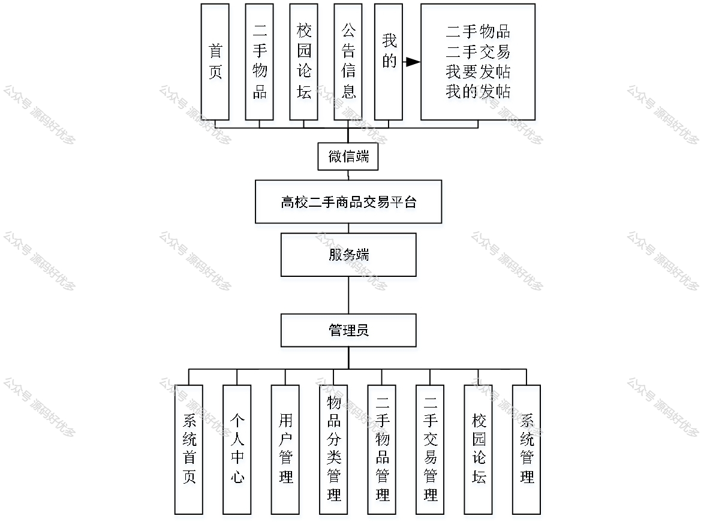
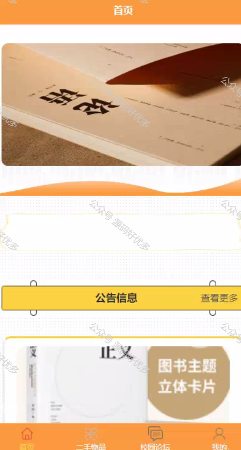
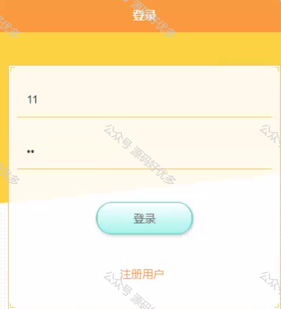
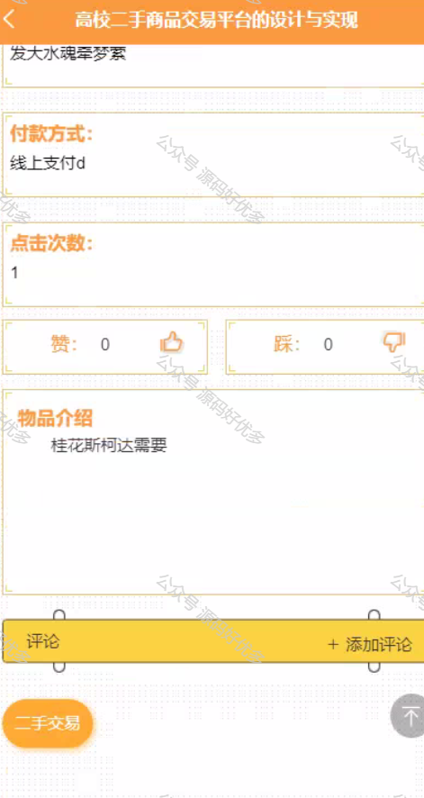
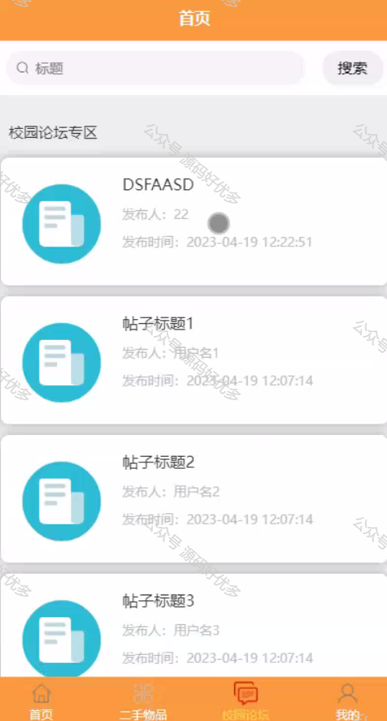
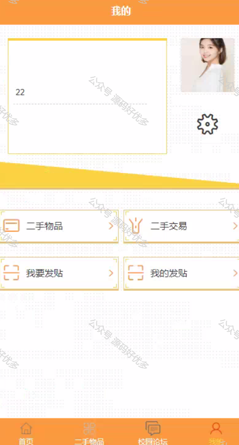
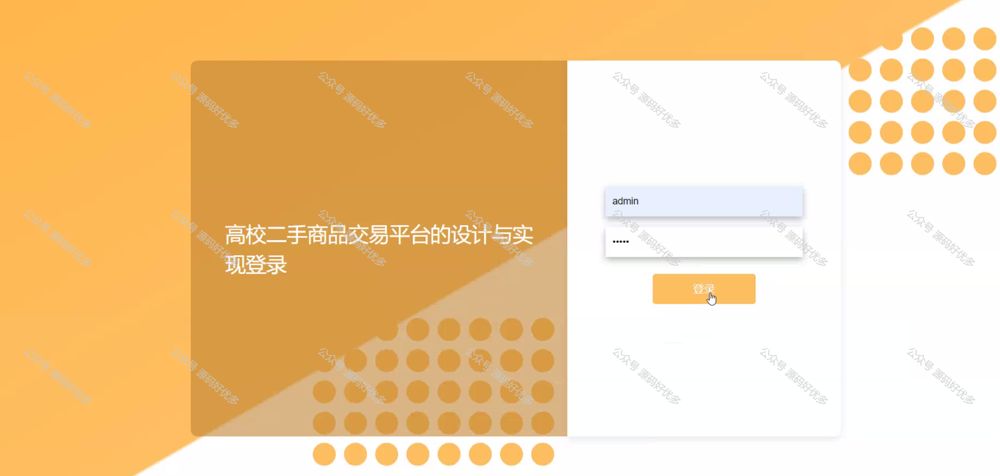
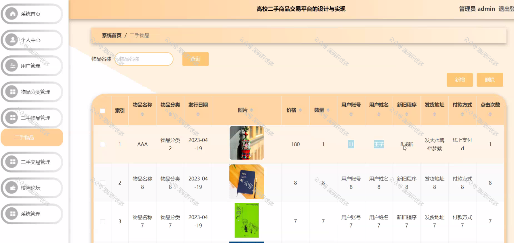
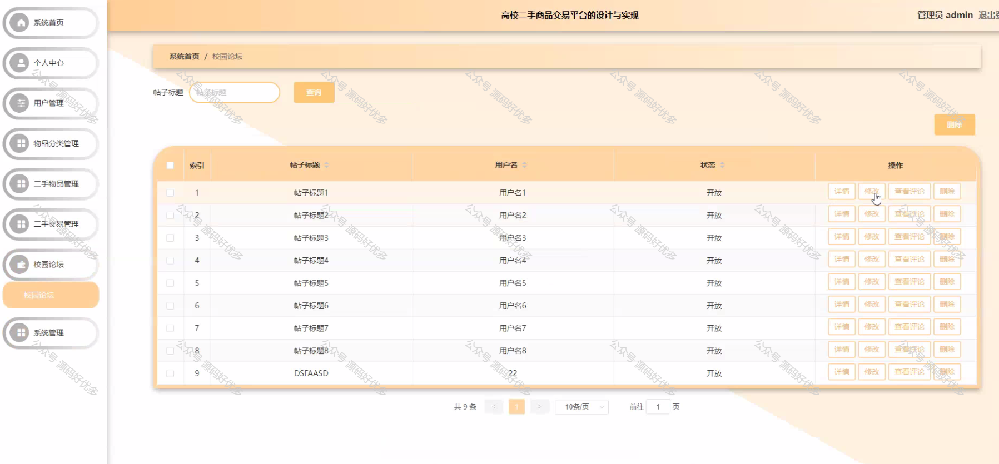
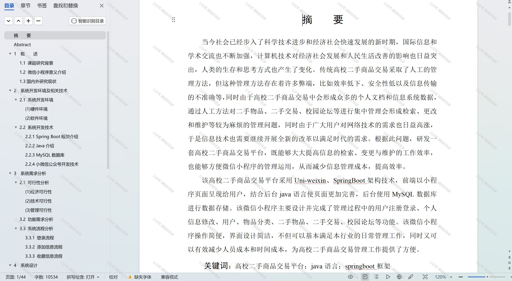

  
